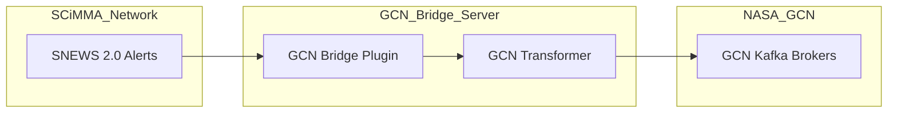

# SNEWS Fireworks Launcher

A production-ready pipeline for "launching" **SNEWS 2.0 JSON messages** into standardized NASA GCN formats. This bridge acts as the central launcher for real-time supernova neutrino alerts, propagating them from the SCiMMA/Hopskotch network to the global astronomical community.

---

## 🚀 Core Functionality

This bridge acts as a **Pass-through Translation** service:
1.  **Listen**: Subscribes to SNEWS 2.0 alerts via the `snews_pt` (Hopskotch) network.
2.  **Transform**: Maps scientific neutrino data into a unified GCN-compatible JSON schema.
3.  **Publish**: Forwards the transformed alerts to NASA GCN (mocked via local Kafka by default).



---

## 📂 Project Structure & File Guide

### Core Logic (`src/`)
*   **[gcn_bridge.py](file:///Users/medhansh29/SNEWS_KAFKA/src/gcn_bridge.py)**: The **Primary Entry Point**. This is the core "Bridge" component that listens to Hopskotch and publishes to GCN. It includes logic to switch between mock and real GCN credentials.
*   **[cli.py](file:///Users/medhansh29/SNEWS_KAFKA/src/cli.py)**: The command-line interface providing access to the bridge and all simulation utilities.
*   **[schemas/snews2_messages.py](file:///Users/medhansh29/SNEWS_KAFKA/src/schemas/snews2_messages.py)**: Contains the internal SNEWS 2.0 Pydantic models for all 5 tiers (Heartbeat, Coincidence, Significance, Timing, Retraction). Handles rigorous validation.
*   **[schemas/snews2_gcn_schema.py](file:///Users/medhansh29/SNEWS_KAFKA/src/schemas/snews2_gcn_schema.py)**: Defines the mapping between SNEWS-specific data and the official NASA GCN Unified format.

### Utilities (`src/utils/`)
*   **[snews2_producer.py](file:///Users/medhansh29/SNEWS_KAFKA/src/utils/snews2_producer.py)**: **Simulation Utility**. Used to generate mock SNEWS 2.0 alerts to simulate a neutrino detector.
*   **[snews2_consumer.py](file:///Users/medhansh29/SNEWS_KAFKA/src/utils/snews2_consumer.py)**: **Verification Utility**. A Kafka consumer that pretty-prints bridged alerts for human inspection.

### Test Suite (`tests/`)
*   **[test_snews2.py](file:///Users/medhansh29/SNEWS_KAFKA/tests/test_snews2.py)**: Unit tests for SNEWS 2.0 message validation and constraints.
*   **[test_snews2_gcn_schema.py](file:///Users/medhansh29/SNEWS_KAFKA/tests/test_snews2_gcn_schema.py)**: Unit tests verifying the transformation from SNEWS to GCN formats.
*   **[test_integration.py](file:///Users/medhansh29/SNEWS_KAFKA/tests/test_integration.py)**: End-to-end integration tests using a live Kafka broker (Docker).

---

## 🛠 Operation Modes

### 🚀 Mode A: The Live Bridge (Production)

This mode connects to the live SCiMMA network to bridge real astronomical data. It operates along two configurable axes:

#### 1. Ingest Axis (SCiMMA Input)
*   **Firedrill Alerts (Frequent)**: The primary **testing vehicle**. You subscribe to the live SCiMMA Firedrill topic to verify your full pipeline with real-world message frequency.
*   **Real Alerts (Rare)**: High-confident astronomical events. Use this for the final production deployment. In this mode, the bridge **continuously listens** in the background, ready to translate and forward a real Galactic Supernova alert the instant it occurs.

#### 2. Publishing Axis (GCN Output)
*   **GCN Mock (Local)**: Publishes to your local Docker Kafka. Ideal for local verification without needing NASA credentials.
*   **NASA GCN (Production)**: The final destination. Requires valid GCN Kafka credentials.

| Use Case | Ingest Axis | Publishing Axis | Configuration |
| :--- | :--- | :--- | :--- |
| **Active Testing**| **Firedrill** | **NASA GCN** | `--firedrill` + `USE_GCN_CREDENTIALS=true` |
| **Real Watch** | **Real** | **NASA GCN** | `--no-firedrill` + `USE_GCN_CREDENTIALS=true` |
| **Local Audit** | Firedrill | Local Docker | `--firedrill` + `USE_GCN_CREDENTIALS=false` |
| **Simulated Dev** | Mock Ingest | Local Docker | Use Mode B (below) |

### Mode B: The Simulation Pipeline (Development)

Use this mode to test the GCN Bridge logic in a completely isolated environment by mocking the **SNEWS 2.0 Ingest** itself.

1.  **Start GCN Mock (Docker)**:
    ```bash
    docker compose up -d
    ```
2.  **Start the Bridge**:
    ```bash
    # Listen to your local mock alerts and bridge to local GCN mock
    python -m src.cli snews2-gcn-bridge --firedrill
    ```
3.  **Simulate an Inbound Detector Alert**:
    In a separate terminal, use the Simulation Utility:
    ```bash
    python -m src.cli snews2-produce --tier coincidence --test
    ```
4.  **Verify GCN Notice Arrival**:
    Use the Verification Utility to view the transformed result in the `snews2-gcn-alerts` topic:
    ```bash
    python -m src.cli snews2-consume
    ```

---

## 🔐 Configuration & Credentials

The bridge behavior is controlled via environment variables in your `.env` file. Proper authentication is required for both Axes of operation:

### 1. Ingest Axis (SCiMMA)
To listen to the live SNEWS 2.0 network, you must authenticate once on your machine:
```bash
hop auth add  # Use scimma credentials
```

### 2. Publishing Axis (NASA GCN)
To publish to the actual NASA GCN, set the following in `.env`:
*   `USE_GCN_CREDENTIALS=true`
*   `GCN_CLIENT_ID` / `GCN_CLIENT_SECRET`: Obtained from the NASA GCN portal.

| Variable | Axis | Description | Default |
| :--- | :--- | :--- | :--- |
| `KAFKA_BOOTSTRAP_SERVERS` | Output | Destination GCN Kafka brokers. | `localhost:9092` |
| `USE_GCN_CREDENTIALS` | Output | Toggle between Mock (Docker) and Production (NASA). | `false` |
| `SNEWS2_TOPIC` | Input | Internal topic used for simulation ingest. | `snews2-alerts` |

---

## 🧪 Testing

Ensure your local Kafka is running (`docker compose up -d`), then run:

```bash
pytest tests/ -v
```

---
> [!IMPORTANT]
> To switch from **Mock Publishing** to **Actual GCN Publishing**, ensure `USE_GCN_CREDENTIALS=true` and provide your authorized GCN credentials in the `.env` file.
